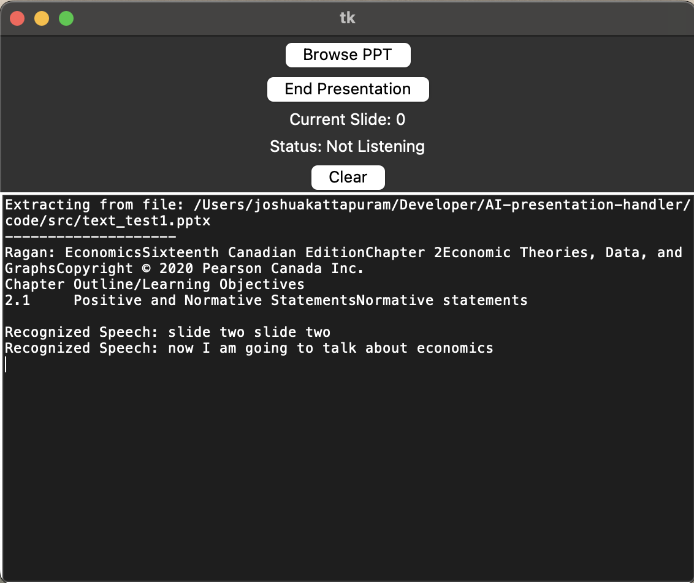

# Smart Slide
Smart program to automate slide transitions in a slideshow using presenter speech as input to eliminate the need to manually change slides each time, making meetings and presentations more efficient.

ML and NLP potential as well.

[Read project summary here](https://docs.google.com/document/d/1dNYObyIvnDCIOuAc87xepQCzqanczHepbfcnmVm-NP8/edit?usp=sharing)

  

To run:

1) Fork the repo
2) Clone the repo
3) navigate to SmartSlide/code/src/
4) run python main.py
